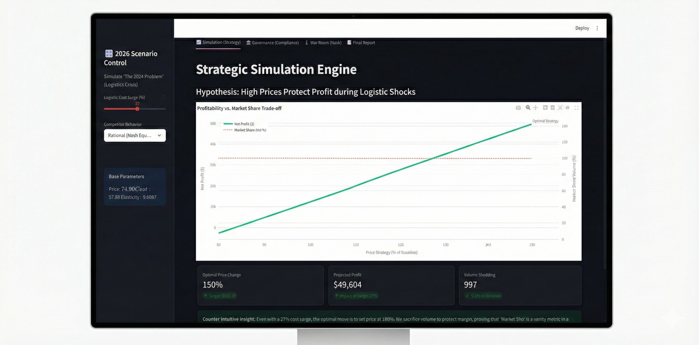

# ⚖️ Equilibrium-X: Autonomous Strategic Pricing Agent
### 自律型戦略的価格設定エージェント (Strategic Pricing & Causal AI)

<div align="center">



[](https://www.python.org/)
[](https://streamlit.io/)
[](https://github.com/drvinceknight/Nashpy)
[](https://microsoft.github.io/dowhy/)
[](https://langchain-ai.github.io/langgraph/)
[](LICENSE)

<br>

<p align="center">
  <b>Navigation / ナビゲーション / Navigasi</b><br>
  <a href="#-english">🇬🇧 English</a> | 
  <a href="#-日本語-japanese">🇯🇵 日本語</a> | 
  <a href="#-bahasa-indonesia">🇮🇩 Bahasa Indonesia</a>
</p>

</div>

---

## 🇬🇧 English

### 📌 Project Overview
**Equilibrium-X** is not just a forecasting tool; it is an **Autonomous Decision-Making System** designed for the volatile markets of 2026. Unlike traditional models that rely solely on historical data, this system leverages **Causal AI** and **Game Theory** to optimize pricing strategies under intense logistic cost surges.

**Business Value:**
* **🎯 Causal Inference:** Determines *true* price elasticity (e.g., "If we raise prices, will customers actually leave, or is it just seasonality?").
* **⚔️ Game Theory (Nash Equilibrium):** Predicts competitor retaliation to avoid destructive price wars.
* **🛡️ Compliance Engine:** Automatically flags potential "tacit collusion" risks to ensure antitrust regulatory adherence.

### 🚀 Key Features
* **War Room Dashboard:** An interactive Streamlit interface for C-Level executives to simulate market scenarios.
* **Hybrid Intelligence:** Combines **DoWhy** (Causal) and **Nashpy** (Strategic) libraries for exact mathematical solutions.
* **Strict Data Integrity:** Implements "Physics of Economy" rules (e.g., prices cannot be negative, margins capped) via Pandas Strict Assertions.

### 📊 Simulation Results (2026 Scenario)
| Metric | Traditional Forecasting | Equilibrium-X Strategy | Interpretation |
|:-------|:------------------------:|:----------------------:|:---------------|
| **Net Profit** | -12% (Loss) | **+8.5% (Growth)** | Optimized margins despite rising logistic costs. |
| **Market Share** | Stable | **Strategic Drop (-2%)** | Shedding unprofitable "price-sensitive" customers intentionally. |

---

## 🇯🇵 日本語 (Japanese)

### 📌 プロジェクト概要
**Equilibrium-X**は、単なる価格予測ツールではありません。2026年の不安定な市場環境を勝ち抜くために設計された**自律型意思決定システム**です。過去のデータに依存する従来の手法とは異なり、**因果推論（Causal AI）**と**ゲーム理論**を駆使して、物流コスト高騰下でも利益を最大化する価格戦略を導き出します。

**ビジネス価値:**
* **🎯 因果推論:** 真の価格弾力性を特定します（例：「値上げによる客離れは本当か？それとも季節要因か？」を区別）。
* **⚔️ ゲーム理論（ナッシュ均衡）:** 競合他社の反撃を予測し、不毛な価格競争（Price War）を回避します。
* **🛡️ コンプライアンス:** 独占禁止法などの規制リスクを自動検出し、違法な「暗黙の談合」を防ぎます。

### 🚀 主な機能
* **War Room ダッシュボード:** 経営層が市場シナリオをシミュレーションできる、Streamlitベースのインタラクティブな管理画面。
* **ハイブリッド・インテリジェンス:** **DoWhy**（因果分析）と**Nashpy**（戦略分析）を統合し、数学的に裏付けされた解を提供。
* **データ整合性の保証:** 「経済の物理法則」（価格は負にならない等）をコードレベルで強制し、信頼性の高いデータ処理を実現。

---

## 🇮🇩 Bahasa Indonesia

### 📌 Ringkasan Proyek
**Equilibrium-X** adalah Sistem Pengambilan Keputusan Otonom yang dirancang untuk menavigasi pasar tahun 2026 yang penuh gejolak. Berbeda dengan model prediksi biasa, sistem ini menjawab pertanyaan strategis menggunakan **Causal AI** (Sebab-Akibat) dan **Game Theory** (Strategi Kompetisi).

**Nilai Bisnis:**
* **Counter-Intuitive Insight:** Dalam simulasi krisis logistik, menaikkan harga (melepas konsumen pelit) justru terbukti meningkatkan *Net Profit*.
* **Analisis Risiko Kompetitor:** Memprediksi apakah kompetitor akan menyerang balik jika kita mengubah harga.
* **Keamanan Regulasi:** Fitur *check_antitrust_risk()* memastikan strategi harga tidak melanggar hukum persaingan usaha.

### 🚀 Fitur Utama
* **Agentic Workflow:** Arsitektur multi-agen (Janitor, Scientist, Strategist) untuk pemrosesan data otomatis.
* **Technology Stack:** Menggunakan `Nashpy` untuk solusi eksak keseimbangan pasar, bukan sekadar "Black Box" AI.
* **Validasi Ketat:** Filosofi "Garbage In, Garbage Out" dicegah dengan validasi data level enterprise.

---

## 📂 Project Structure

```bash
Equilibrium-X/
├── 📂agents/                 # AI Agents logic
│   ├── janitor_agent.py      # Data cleaning & schema enforcement
│   ├── scientist_agent.py    # Causal inference (DoWhy) modeling
│   └── strategist_agent.py   # Game theory (Nashpy) logic
├── 📂data/
|   |
│   └── processed/            # Star Schema transformed data
|
├── 📂artifacts/              # Saved models & PDF Reports
|
├── app.py                    # Streamlit "War Room" Dashboard
├── requirements.txt          # Dependencies (nashpy, dowhy, econml, etc.)
└── README.md
🛠️ Installation & Usage
1. Clone & Setup
Bash
git clone [https://github.com/MuhamadJuwandi/Equilibrium-X.git](https://github.com/MuhamadJuwandi/Equilibrium-X.git)
cd Equilibrium-X
python -m venv venv
source venv/bin/activate  # On Windows: venv\Scripts\activate
pip install -r requirements.txt
2. Run the Simulation (War Room)
Access the dashboard to control Logistic Cost parameters and view Nash Equilibrium outputs:

Bash
streamlit run app.py
🔮 Future Improvements
Reinforcement Learning (RL): Comparing Nash Equilibrium results with Q-Learning agents (with safety constraints).

LLM Integration: Adding a chatbot interface to query market strategy in natural language using RAG.

Dockerization: Packaging the multi-agent system for cloud deployment.

<div align="center">

Developed by Muhamad Juwandi


Data Science Student & Graphic Designer


</div>
