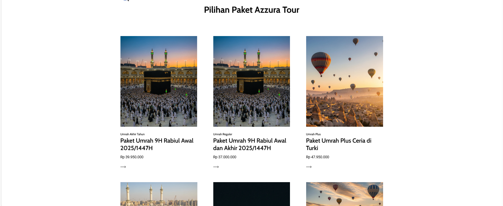
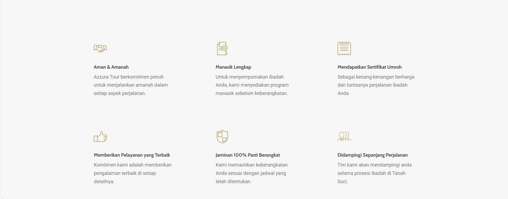
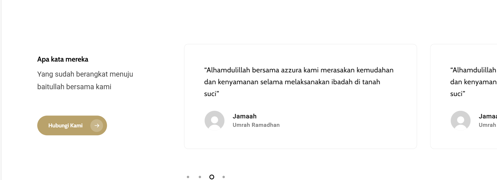

<div align="center">


# 🕋 Umrah Travel Landing Page
### Professional UI/UX Design & Front-End Implementation

<p>
  
  
  
  
  
</p>

[🇬🇧 English](#-english) | [🇯🇵 日本語](#-japanese) | [🇮🇩 Bahasa Indonesia](#-bahasa-indonesia)

<br>

<a href="#">
  
</a>

<br><br>


</div>

---

## 🇬🇧 English

### 📌 Project Overview
This project is a high-fidelity **Landing Page for an Umrah Travel Agency**, designed to build trust and facilitate booking conversions. Leveraging my background in **Graphic Design**, I focused on a clean visual hierarchy using a Green & Gold color palette to evoke spiritual tranquility and professionalism.

### 💡 Key Features
* **Trust-Centric UI:** Prominent placement of testimonials and "Why Choose Us" sections to increase user confidence.
* **Responsive Pricing Cards:** Clear comparison of Umrah packages (Regular vs. VIP) adapted for mobile views.
* **Modern CSS Styling:** Utilized Flexbox and Grid for a pixel-perfect layout matching the Figma design.
* **Interactive Elements:** Smooth hover effects on buttons and cards to enhance User Experience (UX).

---

## 🇯🇵 日本語

### 📌 概要 (Overview)
ウムラ巡礼（Umrah）旅行代理店向けの**高忠実度（High-Fidelity）ランディングページ**です。信頼性を高め、予約コンバージョンを促進するように設計されています。私の**グラフィックデザイン**のバックグラウンドを活かし、緑と金を基調とした配色で、精神的な安らぎとプロフェッショナルな印象を与える視覚的階層（Visual Hierarchy）を構築しました。

### 💡 主な機能 (Key Features)
* **信頼性重視のUI:** ユーザーの信頼を得るため、お客様の声や「選ばれる理由」セクションを戦略的に配置。
* **レスポンシブな料金表:** モバイル表示にも最適化された、ウムラパッケージ（レギュラー/VIP）の比較カード。
* **モダンなCSS設計:** FlexboxとGridを使用し、Figmaのデザインをピクセルパーフェクトに再現。
* **インタラクティブ要素:** ボタンやカードにスムーズなホバーエフェクトを実装し、ユーザー体験（UX）を向上。

---

## 🇮🇩 Bahasa Indonesia

### 📌 Ringkasan
Website landing page untuk Biro Perjalanan Umrah yang dirancang dengan fokus pada estetika dan konversi. Sebagai desainer sekaligus developer, saya memastikan transisi dari desain (Figma) ke kode (HTML/CSS) tetap presisi. Warna hijau dan emas dipilih untuk membangun citra "Amanah" dan "Eksklusif".

### 🖼️ UI/UX Highlights

<table align="center">
  <tr>
    <td align="center" width="50%">
        
        <br><b>📦 Package Cards</b><br>
        <sub>Desain kartu harga yang jelas & informatif.</sub>
    </td>
    <td align="center" width="50%">
        
        <br><b>✨ Why Choose Us</b><br>
        <sub>Penggunaan ikonografi untuk keterbacaan cepat.</sub>
    </td>
  </tr>
  <tr>
    <td align="center" width="50%">
        
        <br><b>🤝 Social Proof</b><br>
        <sub>Layout testimoni untuk membangun kredibilitas.</sub>
    </td>
    <td align="center" width="50%">
        
        <br><b>📱 Responsive Design</b><br>
        <sub>Tampilan tetap rapi di berbagai ukuran layar.</sub>
    </td>
  </tr>
</table>

### 💻 Cara Menjalankan (Installation)

1. Clone repository ini:
   ```bash
   git clone [https://github.com/MuhamadJuwandi/umrah-travel-landing.git](https://github.com/MuhamadJuwandi/umrah-travel-landing.git)
