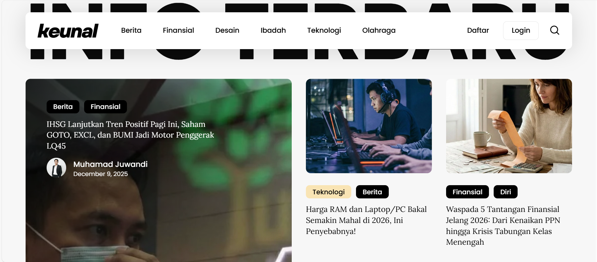

# 🎨 Keunal.id - Data-Driven Creative Lab

[English](#english) | [日本語 (Japanese)](#japanese) | [Bahasa Indonesia](#indonesian)

 

  <h3>✨ Where Creativity Meets Data ✨</h3>
  

    <em>A showcase of graphic design, content creation, and data storytelling.</em>
  

---

## 🇬🇧 English

### 📋 Overview
**Keunal.id** is my creative laboratory where I combine **Graphic Design** with **Data Science insights**. This repository serves as a portfolio for the educational content, visual designs, and social media strategies I have developed. It demonstrates my ability to translate complex information into visually engaging narratives.

### 🖼️ Article Visuals
Visual assets and charts created for my articles found in the `/Article` directory.

| Article Title & Link | Visual Preview |
| :--- | :--- |
| **[📄 Article: Data Trends 2024](./Article/Analisis-Saham.md)** An in-depth look at rising digital trends using Python analysis. |  |
| **[📄 Article: Visual Storytelling](./Article/Tren-Design.md)** Techniques on how to visualize data for non-technical audiences. |  |

### 📸 Instagram Portfolio
A collection of high-performing feeds and reels created for the **@keunal.id** brand.

#### 1. Carousel & Feed Designs

  
  
  

#### 2. Video & Reels
*Click the links below to view the video content:*
* 🎥 **[Video: Introduction to Data Science](Assets/instagram-content/videos/video-intro.mp4)**
* 🎥 **[Video: Design Tips for Developers](Assets/instagram-content/videos/video-tips.mp4)**

---

## 🇯🇵 日本語 (Japanese)

### 概要 (Overview)
**Keunal.id** は、**グラフィックデザイン**と**データサイエンスの洞察**を融合させた私のクリエイティブ・ラボです。このリポジトリでは、私が開発した教育コンテンツ、ビジュアルデザイン、ソーシャルメディア戦略のポートフォリオを紹介しています。複雑な情報を視覚的に魅力的な物語に変換する私の能力を示しています。

### 🖼️ 記事のビジュアル (Article Visuals)
`/Article` ディレクトリにある記事のために作成されたビジュアル素材です。

| 記事タイトル (Title) | プレビュー (Preview) |
| :--- | :--- |
| **[📄 記事：2024年のデータトレンド](./Article/Analisis-Saham.md)** Python分析を用いたデジタルトレンドの深掘り。 |  |
| **[📄 記事：ビジュアル・ストーリーテリング](./Article/Tren-Design.md)** 非技術者向けにデータを視覚化するテクニック。 |  |

### 📸 インスタグラム・ポートフォリオ (Instagram)
**@keunal.id** ブランドのために作成された、高エンゲージメントのフィードとリール集です。

#### 1. フィードデザイン (Feed Designs)

  
  
  

#### 2. 動画コンテンツ (Videos)
*以下のリンクをクリックして動画をご覧ください:*
* 🎥 **[動画：データサイエンス入門](Assets/instagram-content/videos/video-intro.mp4)**
* 🎥 **[動画：開発者のためのデザインのヒント](Assets/instagram-content/videos/video-tips.mp4)**

---

## 🇮🇩 Bahasa Indonesia

### Gambaran Umum
**Keunal.id** adalah laboratorium kreatif saya yang menggabungkan **Desain Grafis** dengan **wawasan Data Science**. Repositori ini berfungsi sebagai portofolio untuk konten edukasi, desain visual, dan strategi media sosial yang telah saya kembangkan. Proyek ini mendemonstrasikan kemampuan saya dalam menerjemahkan informasi kompleks menjadi narasi visual yang menarik.

### 🖼️ Visual Artikel
Aset visual dan grafik yang dibuat untuk artikel yang terdapat di direktori `/Article`.

| Judul Artikel & Tautan | Pratinjau Visual |
| :--- | :--- |
| **[📄 Artikel: Tren Data 2024](./Article/Analisis-Saham.md)** Analisis mendalam tren digital menggunakan Python. |  |
| **[📄 Artikel: Visual Storytelling](./Article/Tren-Design.md)** Teknik memvisualisasikan data untuk audiens non-teknis. |  |

### 📸 Portofolio Instagram
Koleksi desain feed dan reels berkinerja tinggi yang dibuat untuk brand **@keunal.id**.

#### 1. Desain Feed & Carousel

  
  
  

#### 2. Konten Video & Reels
*Klik tautan di bawah untuk melihat file video:*
* 🎥 **[Video: Pengenalan Data Science](Assets/instagram-content/videos/video-intro.mp4)**
* 🎥 **[Video: Tips Desain untuk Developer](Assets/instagram-content/videos/video-tips.mp4)**

---
 

  <small>Designed & Maintained by <a href="https://github.com/MuhamadJuwandi">Muhamad Juwandi</a></small>

