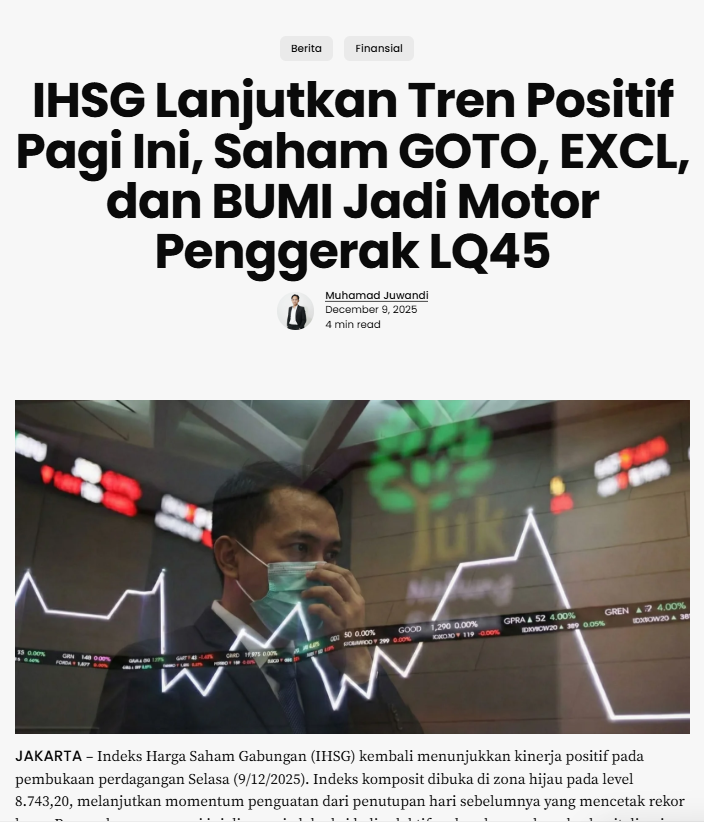
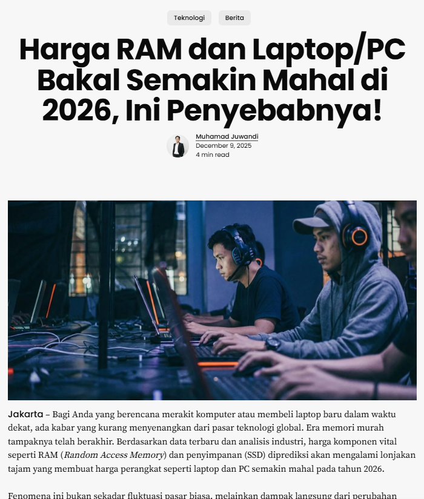

# Keunal.id
### 📰 Information & Educational Media Platform

  
  
  
  

[🇬🇧 English](#-english) | [🇯🇵 日本語](#-japanese) | [🇮🇩 Bahasa Indonesia](#-bahasa-indonesia)

 

  
    
  
  

---

## 🇬🇧 English

### 📋 About The Platform
**Keunal.id** is an informational media platform providing diverse educational and current content ranging from technology, finance, and sports to general news.

As a **Content Creator**, my primary responsibilities include:
1.  **Article Writing:** Conducting in-depth research on current issues and topics to structure informative articles relevant to reader needs.
2.  **Visual Design:** Creating data visualizations and Instagram feed/carousel designs using **Canva** to enhance content engagement.
3.  **Video Editing:** Creating and editing video clippings from YouTube for Instagram Reels content using **CapCut**.

### 🖼️ Article Visuals
Visual assets and charts created for my articles found in the `/Article` directory.

| Article Title & Link | Visual Preview |
| :--- | :--- |
| **[📄 Article: IHSG Strengthens (Dec 2025)](https://keunal.id/berita/ihsg-menguat-9-desember-2025/)** Analysis of the Indonesian Joint Stock Price Index (IHSG) market movements and economic impact. |  |
| **[📄 Article: RAM Prices Surge in 2026](https://keunal.id/teknologi/harga-ram-laptop-pc-makin-mahal-2026/)** Tech insight regarding the rising costs of Laptop/PC components and market predictions. |  |

### 📸 Instagram Portfolio
A collection of high-performing feeds and reels created for the **@keunal.id** brand.

#### 1. Carousel & Feed Designs

  
  
  

#### 2. Video & Reels
*Click the links below to view the video content:*
* 🎥 **[Video: Introduction to Data Science](Assets/instagram-content/videos/video-intro.mp4)**
* 🎥 **[Video: Design Tips for Developers](Assets/instagram-content/videos/video-tips.mp4)**

---

## 🇯🇵 日本語 (Japanese)

### 概要 (Overview)
**Keunal.id** は、テクノロジー、金融、スポーツから一般ニュースに至るまで、多様な教育的かつ最新のコンテンツを提供する情報メディアプラットフォームです。

**コンテンツクリエイター**としての私の主な責任は以下の通りです：
1.  **記事執筆 (Article Writing):** 最新の課題やトピックについて深く調査し、読者のニーズに関連する有益な記事を作成します。
2.  **ビジュアルデザイン (Visual Design):** **Canva**を使用してデータ視覚化やInstagramのフィード/カルーセルデザインを作成し、コンテンツの魅力を高めます。
3.  **動画編集 (Video Editing):** **CapCut**を使用してYouTubeからの切り抜き動画を作成・編集し、Instagramリール用のコンテンツを制作します。

### 🖼️ 記事のビジュアル (Article Visuals)
記事のために作成されたビジュアル素材とリンクです。

| 記事タイトル (Title) | プレビュー (Preview) |
| :--- | :--- |
| **[📄 記事：IHSG（インドネシア株価指数）の強化](https://keunal.id/berita/ihsg-menguat-9-desember-2025/)** 2025年12月の株式市場の動きと経済への影響に関する分析。 |  |
| **[📄 記事：2026年 PC用メモリ(RAM)価格の高騰](https://keunal.id/teknologi/harga-ram-laptop-pc-makin-mahal-2026/)** ノートPCおよびデスクトップPCのパーツ価格上昇に関する技術的洞察。 |  |

### 📸 インスタグラム・ポートフォリオ (Instagram)
**@keunal.id** ブランドのために作成された、フィードとリール集です。

#### 1. フィードデザイン (Feed Designs)

  
  
  

---

## 🇮🇩 Bahasa Indonesia

### Gambaran Umum
**Keunal.id** adalah platform media informasi yang menyajikan beragam konten edukatif dan aktual seputar teknologi, keuangan, olahraga, hingga berita umum.

Sebagai **Content Creator**, saya memiliki tanggung jawab utama dalam:
1.  **Menulis Artikel:** Melakukan riset mendalam mengenai isu dan topik terkini, lalu menyusun artikel yang informatif serta relevan dengan kebutuhan pembaca.
2.  **Desain Visual:** Membuat visualisasi data, serta desain feed dan carousel Instagram menggunakan **Canva** untuk memperkuat daya tarik konten.
3.  **Video Editing:** Membuat dan mengedit video clipping dari YouTube untuk konten Reels Instagram menggunakan **CapCut**.

### 🖼️ Visual Artikel
Aset visual yang saya buat untuk artikel yang telah dipublikasikan di website.

| Judul Artikel & Tautan | Pratinjau Visual |
| :--- | :--- |
| **[📄 Artikel: IHSG Menguat (Desember 2025)](https://keunal.id/berita/ihsg-menguat-9-desember-2025/)** Analisis pergerakan pasar saham gabungan dan dampaknya terhadap ekonomi. |  |
| **[📄 Artikel: Harga RAM Laptop/PC Makin Mahal 2026](https://keunal.id/teknologi/harga-ram-laptop-pc-makin-mahal-2026/)** Ulasan teknologi mengenai tren kenaikan harga komponen komputer. |  |

### 📸 Portofolio Instagram
Koleksi desain feed dan reels yang saya buat untuk brand **@keunal.id**.

#### 1. Desain Feed & Carousel

  
  
  

#### 2. Konten Video & Reels
*Klik tautan di bawah untuk melihat file video:*
* 🎥 **[Video: Pengenalan Data Science](Assets/instagram-content/videos/video-intro.mp4)**
* 🎥 **[Video: Tips Desain untuk Developer](Assets/instagram-content/videos/video-tips.mp4)**

---
 

  <small>Content Created by <b>Muhamad Juwandi</b> for Keunal.id</small>

