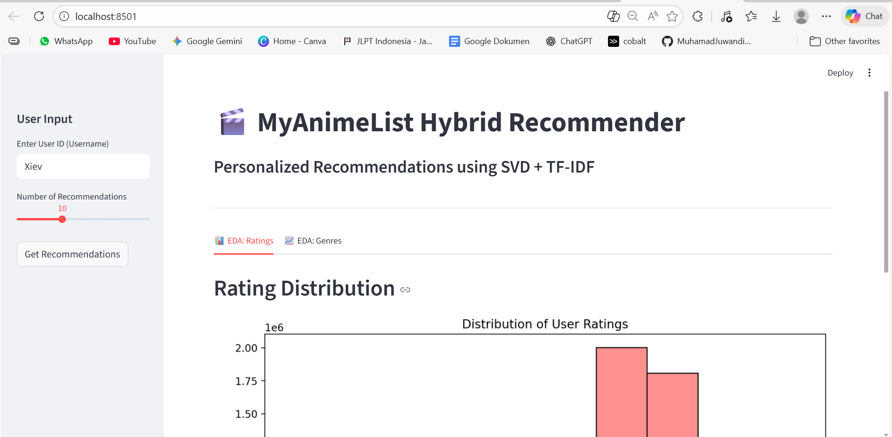

# 🎬 MAL Recommender Hybrid System


[English](#english) | [日本語 (Japanese)](#japanese) | [Bahasa Indonesia](#indonesian)

<br>

<div align="center">
  
  <br>
  <em>Preview of the Recommendation Dashboard</em>
</div>

---

<a name="english"></a>
## 🇬🇧 English

### Overview
**MAL Recommender Hybrid** is a scalable recommendation engine built on the MyAnimeList dataset. It utilizes a **Hybrid Filtering** approach, combining **Collaborative Filtering (SVD)** to capture user latent preferences and **Content-Based Filtering (TF-IDF)** to recommend similar items based on genres and metadata.

This project demonstrates an end-to-end Data Science workflow: from efficient data processing (Parquet/Sampling) to model deployment via a Streamlit Dashboard and REST API.

### Key Features
* **Hybrid Engine:** Weighted combination of SVD (Matrix Factorization) and TF-IDF (Cosine Similarity).
* **Cold Start Handling:** Automatically suggests popular anime for new/anonymous users.
* **Memory Efficient:** Implements data sampling and Parquet storage to run on standard hardware.
* **Interactive UI:** A user-friendly dashboard to explore recommendations and visualize EDA.

### Project Structure
* `src/`: Core algorithms (Preprocessing, Model logic).
* `dashboard/`: Frontend application using Streamlit.
* `api/`: Backend service using FastAPI.
* `data/`: Storage for processed Parquet files.

### 🚀 How to Run

**1. Clone the Repository**
```bash
git clone [https://github.com/USERNAME/mal-recommender-hybrid.git](https://github.com/USERNAME/mal-recommender-hybrid.git)
cd mal-recommender-hybrid


