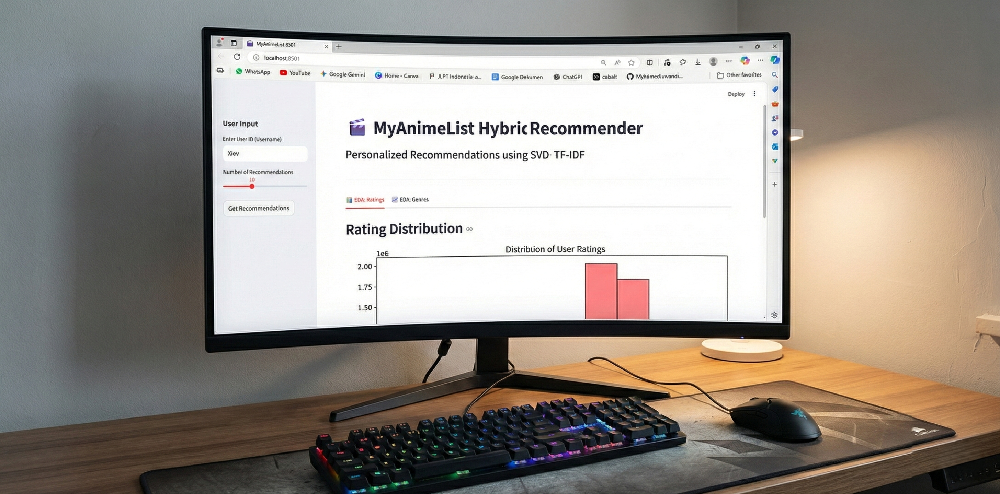

# 🎬 MAL Recommender Hybrid System

[](https://www.python.org/)
[](https://streamlit.io/)
[](https://fastapi.tiangolo.com/)
[](https://www.kaggle.com/datasets/azathoth42/myanimelist)


[English](#english) | [日本語 (Japanese)](#japanese) | [Bahasa Indonesia](#indonesian)

<br>

<div align="center">
  
  <br>
  <em>Preview of the Recommendation Dashboard</em>
</div>

---

<a name="english"></a>
## 🇬🇧 English

### Overview
**MAL Recommender Hybrid** is a scalable recommendation engine designed to solve the *information overload* problem for anime fans. It utilizes a **Hybrid Filtering** approach, combining **Collaborative Filtering (SVD)** to capture latent user preferences and **Content-Based Filtering (TF-IDF)** to recommend items based on genre similarity and metadata.

This project demonstrates an end-to-end Data Science workflow: from efficient data processing (Parquet/Sampling) to model deployment via a Streamlit Dashboard and REST API.

### 📊 Data Source
The model is trained on the comprehensive **MyAnimeList Dataset** hosted on Kaggle.
* **Source:** [Kaggle - MyAnimeList Dataset (azathoth42)](https://www.kaggle.com/datasets/azathoth42/myanimelist)
* **Data Points:** User ratings, anime metadata (genres, studios), and user activity logs.

### Key Features
* **Hybrid Engine:** Weighted combination of SVD (Matrix Factorization) and TF-IDF (Cosine Similarity) for higher accuracy.
* **Cold Start Handling:** Automatically suggests trending/popular anime for new users without history.
* **Memory Efficient:** Implements `PyArrow` for Parquet storage to handle large datasets on standard hardware.
* **Interactive UI:** A user-friendly dashboard for real-time inference and EDA visualization.

### Project Structure
* `src/`: Core algorithms (Preprocessing, Model Logic, Evaluation).
* `dashboard/`: Frontend application using Streamlit.
* `api/`: Backend service using FastAPI for scalable inference.
* `data/`: Processed Parquet files and sampled datasets.

---

<a name="japanese"></a>
## 🇯🇵 日本語 (Japanese)

### 概要
**MAL Recommender Hybrid** は、アニメファンのためのスケーラブルな推薦システムです。**SVD（協調フィルタリング）** と **TF-IDF（コンテンツベースフィルタリング）** を組み合わせたハイブリッド手法を採用し、ユーザーの潜在的嗜好と作品の特徴（ジャンル等）を統合して最適なレコメンデーションを行います。

本プロジェクトは、データ処理（Parquet/サンプリング）からモデルのデプロイ（Streamlit および REST API）まで、エンドツーエンドのデータサイエンスワークフローを実装しています。

### 📊 データソース
本モデルは、Kaggle上の **MyAnimeList データセット** を使用して学習されています。
* **提供元:** [Kaggle - MyAnimeList Dataset (azathoth42)](https://www.kaggle.com/datasets/azathoth42/myanimelist)
* **データ内容:** ユーザー評価、アニメのメタデータ（ジャンル、制作会社）、ユーザーアクティビティログ。

### 主な特徴
* **ハイブリッドエンジン:** SVD（行列分解）と TF-IDF（コサイン類似度）の加重平均による高精度化。
* **コールドスタート対策:** 履歴のない新規ユーザーに対して、トレンドや人気作品を自動提案。
* **メモリ効率化:** `PyArrow` を活用した Parquet 形式でのデータ管理により、大規模データの処理を最適化。
* **インタラクティブUI:** リアルタイム推論と探索的データ解析（EDA）を可視化するダッシュボード。

### プロジェクト構成
* `src/`: コアアルゴリズム（前処理、モデルロジック、評価）
* `dashboard/`: Streamlit フロントエンドアプリ
* `api/`: FastAPI バックエンド（推論用API）
* `data/`: Parquet ファイルおよび処理済みデータ

---

<a name="indonesian"></a>
## 🇮🇩 Bahasa Indonesia

### Gambaran Umum
**MAL Recommender Hybrid** adalah sistem rekomendasi berskala besar yang dibangun untuk mengatasi masalah *information overload* bagi penggemar anime. Proyek ini menggunakan pendekatan **Hybrid Filtering**, menggabungkan **Collaborative Filtering (SVD)** untuk menangkap preferensi implisit pengguna dan **Content-Based Filtering (TF-IDF)** untuk merekomendasikan anime berdasarkan kesamaan genre dan metadata.

Proyek ini mendemonstrasikan alur kerja Data Science secara menyeluruh, mulai dari pengolahan data efisien (Parquet/Sampling) hingga deployment model menggunakan Streamlit Dashboard dan REST API.

### 📊 Sumber Data
Model ini dilatih menggunakan **MyAnimeList Dataset** yang tersedia di Kaggle.
* **Sumber:** [Kaggle - MyAnimeList Dataset (azathoth42)](https://www.kaggle.com/datasets/azathoth42/myanimelist)
* **Poin Data:** Rating pengguna, metadata anime (genre, studio), dan log aktivitas pengguna.

### Fitur Utama
* **Mesin Hybrid:** Kombinasi terbobot antara SVD (Matrix Factorization) dan TF-IDF (Cosine Similarity).
* **Penanganan Cold Start:** Secara otomatis menyarankan anime populer/trending untuk pengguna baru yang belum memiliki riwayat tontonan.
* **Efisiensi Memori:** Mengimplementasikan penyimpanan `PyArrow` Parquet untuk menangani dataset besar pada hardware standar.
* **Antarmuka Interaktif:** Dashboard visual untuk eksplorasi rekomendasi dan visualisasi EDA.

### Struktur Proyek
* `src/`: Algoritma utama (Preprocessing, Logika Model, Evaluasi).
* `dashboard/`: Aplikasi frontend menggunakan Streamlit.
* `api/`: Layanan backend menggunakan FastAPI.
* `data/`: Penyimpanan data hasil olahan (Parquet).

---

### 🚀 How to Run / 実行方法 / Cara Menjalankan

```bash
# 1. Clone the Repository
git clone [https://github.com/MuhamadJuwandi/data-science-portfolio.git](https://github.com/MuhamadJuwandi/data-science-portfolio.git)
cd data-science-portfolio/mal-recommender-hybrid

# 2. Install Dependencies (Ensure Python 3.10+)
pip install -r requirements.txt

# 3. Run the Dashboard
python -m streamlit run dashboard/app.py
