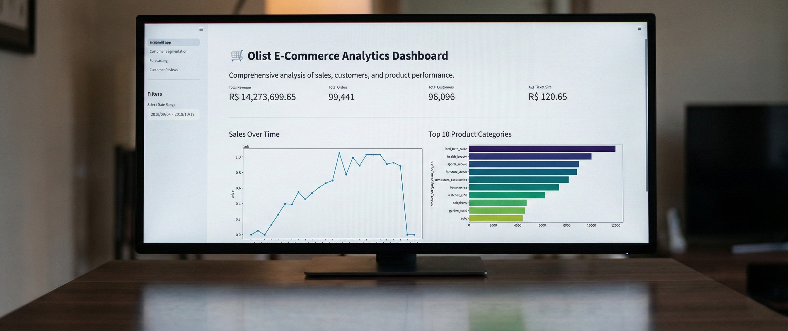

# 🛒 Olist E-Commerce Analytics: End-to-End Intelligence


[](https://www.python.org/)
[](https://streamlit.io/)
[](https://scikit-learn.org/)
[](https://facebook.github.io/prophet/)
[](LICENSE)

<p align="center">
  <b>Navigation / ナビゲーション / Navigasi</b><br>
  <a href="#-english-overview">🇬🇧 English</a> | 
  <a href="#-プロジェクト概要">🇯🇵 日本語</a> | 
  <a href="#-ringkasan-proyek">🇮🇩 Indonesia</a>
</p>

---

<a name="-english-overview"></a>
## 🇬🇧 English Overview

### 🧐 Business Context
Using real-world dataset from **Olist (Brazil)**, this project bridges the gap between raw data and strategic decision-making. It addresses key e-commerce challenges: **Customer Churn**, **Inventory Mismanagement**, and **Service Quality**.

### 🚀 Key Features (End-to-End)
1.  **Modular Pipeline**: Transformed raw notebooks into production-ready scripts (`scripts/`).
2.  **Advanced Segmentation**: Used **RFM + K-Means Clustering** to identify high-value customers.
3.  **Smart Forecasting**: Implemented **Prophet** to predict sales trends and optimize inventory.
4.  **Multi-Page Dashboard**: A comprehensive Streamlit app with dedicated pages for Segmentation, Forecasting, and Sentiment Analysis.

### 📥 Download Reports
* 📄 [Full Analysis Report (Global)](reports/E-Commerce_Data_Analysis_Project_Olist_Muhamad_Juwandi.pdf)
* 📄 [Laporan Analisis (Indonesia)](reports/Proyek_Analisis_Data_E-Commerce_Olist_Muhamad_Juwandi.pdf)

---

<a name="-プロジェクト概要"></a>
## 🇯🇵 プロジェクト概要

### 🧐 背景
**Olist（ブラジル）**の実データを使用し、生のデータを戦略的な意思決定へと昇華させました。本プロジェクトは、Eコマースにおける主要な課題（**顧客離れ**、**在庫管理の不備**、**サービス品質**）に対するデータサイエンス・ソリューションです。

### 🚀 主な特徴
1.  **モジュール化されたパイプライン**: 実験的なNotebookを、本番環境で使えるPythonスクリプト（`scripts/`）に変換。
2.  **高度なセグメンテーション**: **RFM分析 + K-Meansクラスタリング**を用い、優良顧客（Champions）を特定。
3.  **需要予測AI**: **Prophet**（時系列モデル）を導入し、将来の売上トレンドを予測して在庫を最適化。
4.  **マルチページ・ダッシュボード**: Streamlitを使用し、セグメンテーション、予測、レビュー分析の専用ページを備えたWebアプリを構築。

---

<a name="-ringkasan-proyek"></a>
## 🇮🇩 Ringkasan Proyek

### 🧐 Konteks Bisnis
Proyek ini mengubah data transaksi mentah **Olist (Brazil)** menjadi strategi bisnis yang dapat dieksekusi. Fokus utama adalah menyelesaikan masalah **Churn Pelanggan**, **Manajemen Stok**, dan **Kualitas Layanan** logistik.

### 🚀 Fitur Unggulan
1.  **Pipeline Modular**: Mengonversi Jupyter Notebook menjadi script Python modular (`scripts/`) yang lebih rapi dan *reusable*.
2.  **Segmentasi Lanjut**: Menggabungkan analisis **RFM** dengan **K-Means Clustering** untuk pemetaan profil pelanggan yang akurat.
3.  **Forecasting Cerdas**: Menggunakan algoritma **Prophet** untuk memprediksi tren penjualan dan musim puncak.
4.  **Dashboard Terintegrasi**: Aplikasi Streamlit dengan navigasi *Multi-Page* untuk analisis mendalam di setiap sektor.

---

## 📂 Project Structure

```bash
olist-dashboard-project/
├── 📂 dashboard/                  # Web App Visualization
│   ├── 📂 pages/                  # Multi-page Logic
│   │   ├── 2_Customer_Segmentation.py  
│   │   ├── 3_Forecasting.py            
│   │   └── 4_Customer_Reviews.py       
│   ├── logo.jpg                   
│   └── streamlit_app.py           # [MAIN ENTRY POINT]
│
├── 📂 dataset/                    # Data Storage
│   ├── cleaned_data.pkl           # Processed Data (Pickle)
│   ├── customer_segmentation.pkl  # Trained Model
│   └── ... (Raw CSVs)
│
├── 📂 notebooks/                  # Experiments & Analysis
│   ├── 1_data_cleaning.ipynb      
│   ├── 2_eda_insight.ipynb        
│   ├── 3_customer_segmentation.ipynb 
│   └── 4_forecasting.ipynb        
│
├── 📂 reports/                    # Professional Documentation (PDF)
├── 📂 scripts/                    # Modular Python Scripts (Production Ready)
├── 📂 visuals/                    # Assets for README/Presentation
├── requirements.txt               # Dependencies
└── README.md                      # Documentation

```

---

## ⚙️ Installation & Usage

### 1. Clone Repository

```bash
git clone [https://github.com/MuhamadJuwandi/olist-dashboard-project.git](https://github.com/MuhamadJuwandi/olist-dashboard-project.git)
cd olist-dashboard-project

```

### 2. Install Dependencies

```bash
pip install -r requirements.txt

```

### 3. Data Preparation (Optional)

If `.pkl` files are missing in `dataset/`, run the cleaning script:

```bash
python scripts/data_cleaning.py

```

### 4. Run Dashboard

```bash
python -m streamlit run dashboard/streamlit_app.py
```

---

## 📬 Contact & Portfolio

**Muhamad Juwandi** *Data Science Enthusiast | Graphic Designer*

```
